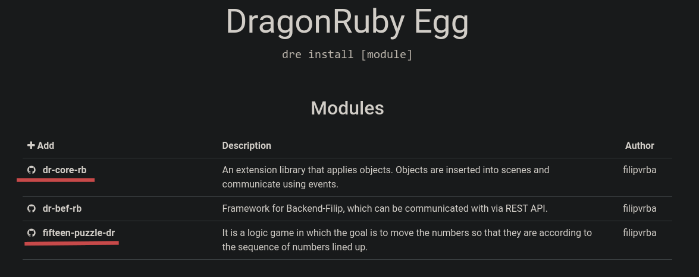
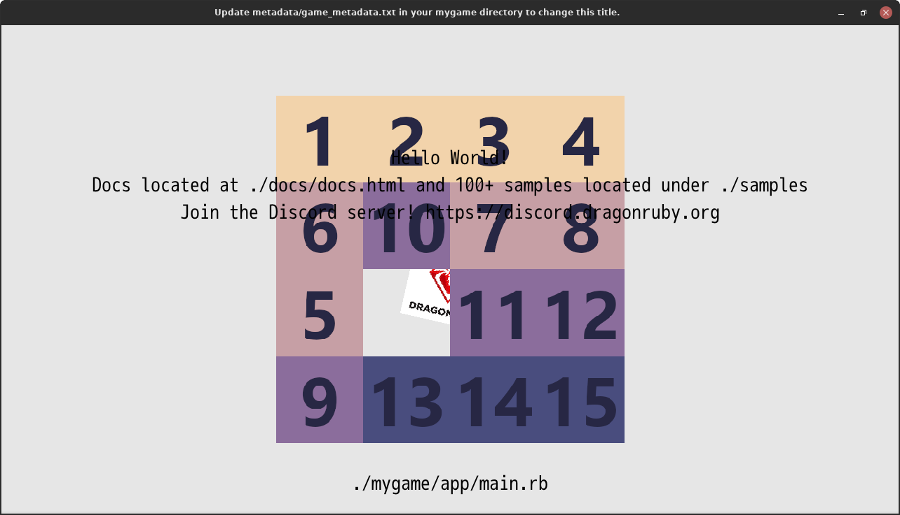

# Usage Tutorial

This article will discuss how to use the [DragonRuby Egg (CLI)](https://github.com/filipvrba/dragonruby-egg-rb) application. We will try out how to create a new game project and add some modules to it. One of the modules is a 15 puzzle game that will be independent of the code architecture of the already created game project.

> ### Info
> DragonRuby Egg (CLI) is a prototype and is primarily designed for **Linux** distribution. If you are using another operating system, it is possible that the application will not work properly.

### Content
- [1 Installation](#1-installation)
  - [1.1 Version](#11-version)
- [2 New project](#2-new-project)
- [3 Installation of modules](#3-installation-of-modules)
  - [3.1 Init](#31-init)
  - [3.2 Error](#32-error)
  - [3.3 Repair](#33-repair)
- [4 Startup](#4-startup)
- [5 Conclusion](#5-conclusion)

## 1 Installation
In order to use DragonRuby Egg (CLI), you need to install it.
(Just use the *gem* command from the ruby ecosystem.)

```bash
gem install dragonruby-egg
```

## 1.1 Version
After installing the gem, we will use the **dre** command, which runs
DragonRuby Egg (CLI) application.
*To test if the application works, we'll write down what version we have:*

```bash
dre -v
```

It should run the program from the message that it was not found
the root path for DragonRuby has been found. This *dre* application communicates with
DragonRuby application and therefore the *dre* application automatically tries to find
where DragonRuby is installed. This may take a while. If it finds you
path, it will tell you which path it found and then list the version of *dre*
application. It is recommended that the application version be **1.0.4** and above.

*Here is a sample of the dre application listing:*
```txt
filip@travelmate:~$ dre -v
9:11:03 AM [dre] ROOT-PATH | The root path has not been set and so the analysis of the root path is performed.
9:11:28 AM [dre] SET | root_path: /home/filip/.local/opt/dragonruby-linux-amd64
9:11:28 AM [dre] VERSION | 1.0.4
```

> ### Info
> If the *dre* application couldn't automatically find the path to DragonRuby, you need to set it manually.
*Please take a look using this command for more information:*
> ```bash
> dre -h
> ```

## 2 New project
It's time to create a new game project using the command.
For example, name the project *dre_tutorial* and
create it on the desktop. Then we'll start the project and check it out,
to see if it works.

*Here is the command to create a new project:*
```bash
dre new dre_tutorial ~/Desktop
```

A new project will be created and we can start it using the dre command.
Just add the path to the project here and run the command. This will start
the game project.

*Here is the command to start the new project:*
```bash
dre ~/Desktop/dre_tutorial
```

If everything goes right, you will see the DragonRuby welcome window.

## 3 Installation of modules
In order to run the 15 puzzle game, we install it as a module in the project.
This game has one dependency on the module that favors object-oriented architecture.
During installation, we'll test what happens if we don't have the
another module for the code dependency and then we install it.

*As a first step, we set up the primary path to the project:*
```bash
cd ~/Desktop/dre_tutorial
```

The next step is to look at the [DragonRuby Egg](https://dragonruby-egg-ui-rjs.vercel.app/)  website
and find out the name of the modules we need to install.



*(pic. 1) DragonRuby Egg website with module names highlighted in red.*

*We need these modules:*
1. **fifteen-puzzle-dr**
2. **dr-core-rb**

As the website suggests, just write a command to install the name module, which
we've already looked up. The first thing we do is install the *fifteen-puzzle-dr* module.

*Here is the command to install the first module with the relevant project path:*
```bash
dre install fifteen-puzzle-dr .
```

The *dre* application will ask us if we really want to install this module.
We confirm with *y* and then the github repository is cloned.
At the end, the application will automatically change the paths to be relevant for
the newly created game project.

*Here's a sample of the dre application dump:*
```txt
filip@travelmate:~/Desktop/dre_tutorial$ dre install fifteen-puzzle-dr .
Install this 'filipvrba.fifteen-puzzle-dr' module? (y/N): y
Cloning into './modules/fifteen-puzzle-dr'...
remote: Enumerating objects: 233, done.
remote: Counting objects: 100% (233/233), done.
remote: Compressing objects: 100% (146/146), done.
remote: Total 233 (delta 74), reused 199 (delta 43), pack-reused 0
Receiving objects: 100% (233/233), 207.36 KiB | 419.00 KiB/s, done.
Resolving deltas: 100% (74/74), done.
10:11:48 AM [dre] INSTALL | The 'fifteen-puzzle-dr' module has been installed in this './modules/fifteen-puzzle-dr' folder.
10:11:48 AM [dre] INSTALL | All paths for this 'fifteen-puzzle-dr' module have been changed.
```

## 3.1 Init
To run this installed *fifteen-puzzle-dr* module in our game project,
we import it into the *app/main.rb* file and then initialize it.
This should get the 15 puzzle game up and running in our game project.

*Here is the overall code for the main.rb file:*
```rb
# ./app/main.rb
require 'modules/fifteen-puzzle-dr/app/init.rb'  # <= The code has been added here.

def tick args
  args.outputs.labels  << [640, 540, 'Hello World!', 5, 1]
  args.outputs.labels  << [640, 500, 'Docs located at ./docs/docs.html and 100+ samples located under ./samples', 5, 1]
  args.outputs.labels  << [640, 460, 'Join the Discord server! https://discord.dragonruby.org', 5, 1]

  args.outputs.sprites << { x: 576,
                            y: 280,
                            w: 128,
                            h: 101,
                            path: 'dragonruby.png',
                            angle: args.state.tick_count }

  args.outputs.labels  << { x: 640,
                            y: 60,
                            text: './mygame/app/main.rb',
                            size_enum: 5,
                            alignment_enum: 1 }

  FifteenPuzzleDR.init args  # <= The code has been added here.
end
```

## 3.2 Error
It should give us an error when we start the game project.
It tells us that it is expecting a module named *dr-core-rb*.
This module, as I mentioned earlier, is a dependency for the *fifteen-puzzle-dr* module
and needs to be reinstalled.

*Here I will give the command to start the game project:*
```bash
dre .
```

*In the window or in the terminal we get an error message, here is an example of the message:*
```txt
...
INFO: modules/dr-core-rb/lib/core-1.0.1/core.rb does not exist. (RuntimeError)
- 000000 [Game] Game state and exception will be written to logs/exceptions/game_state_-1.txt and logs/exceptions/current.txt.
- 000000 [Game] * EXCEPTION: modules/dr-core-rb/lib/core-1.0.1/core.rb does not exist.
** Backtrace:
*** modules/fifteen-puzzle-dr/app/init.rb:2 (-1)
```

## 3.3 Repair
To fix this bug, we will install a second module in the game project.
This will fix the functionality of the code for the *fifteen-puzzle-dr* module.

*Here is the command to install the second module:*
```bash
dre install dr-core-rb .
```

## 4 Startup
When we start the *dre_tutorial* project, we will be rendered 15 puzzle game. For the demonstration we left the welcome code from DragonRuby and can be noticed, the overlapping of the rendered objects. That's okay.



*(pic. 2) Running a game project with rendered objects overlapping each other.*

## 5 Conclusion
And that's the end of the tutorial for DragonRuby Egg (CLI). We showed how to use the *dre* tool to create a new project and install modules to get a working game of 15 puzzles up and running. As you can see, we wrote very little code in the game project. We just implemented the 2 lines of code needed to get the 15 puzzles moving.
